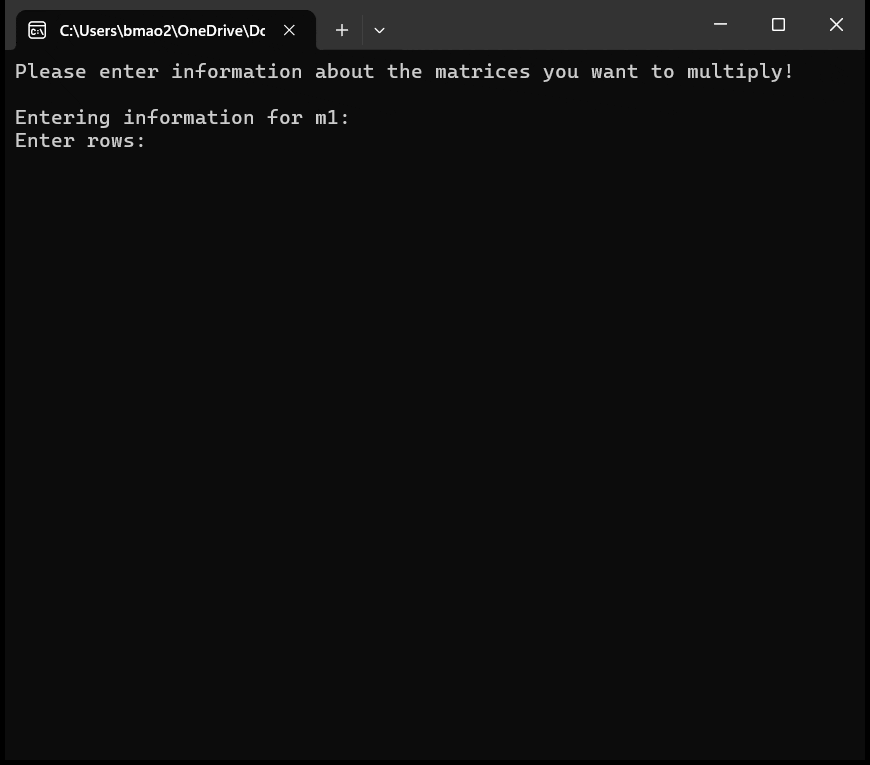

# Matrix Multiplication Calculator

A simple program to multiply matrices within the terminal written in C. This project demonstrates a classic linear algebra operation and the usage of pointers as arrays and double pointers as 2D arrays.



## Build Instructions

To compile the program, first fork and clone the repository, ensure you have `gcc` installed, and then run the following command in your terminal:

```sh
gcc -std=c99 -Wall -Wextra -o calculator.exe calculator.c
```
